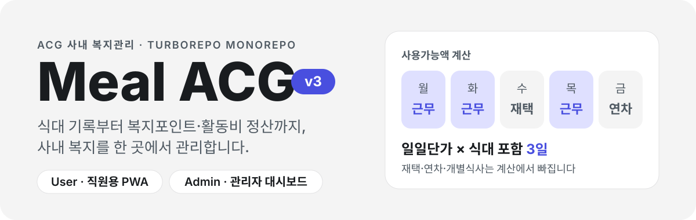
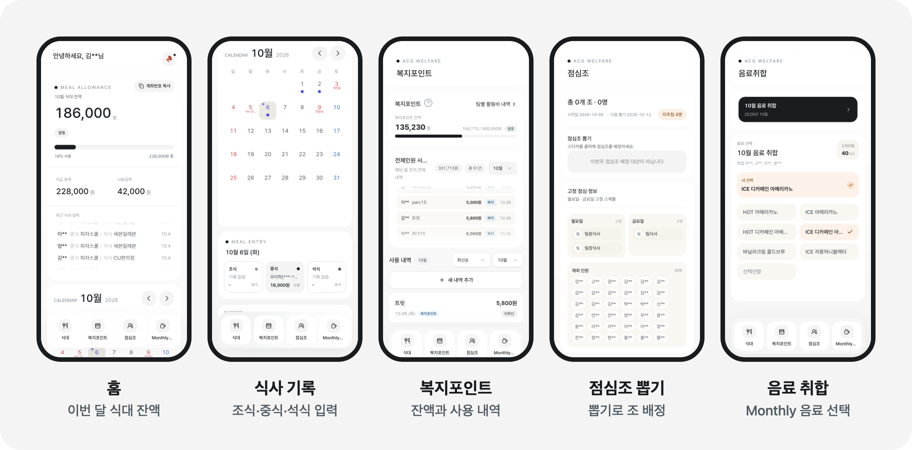
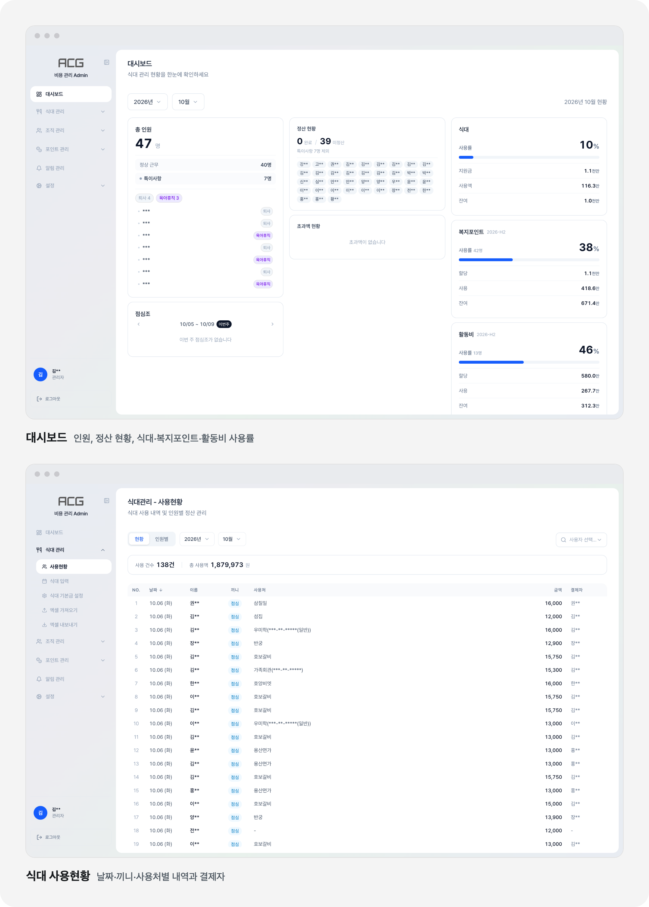
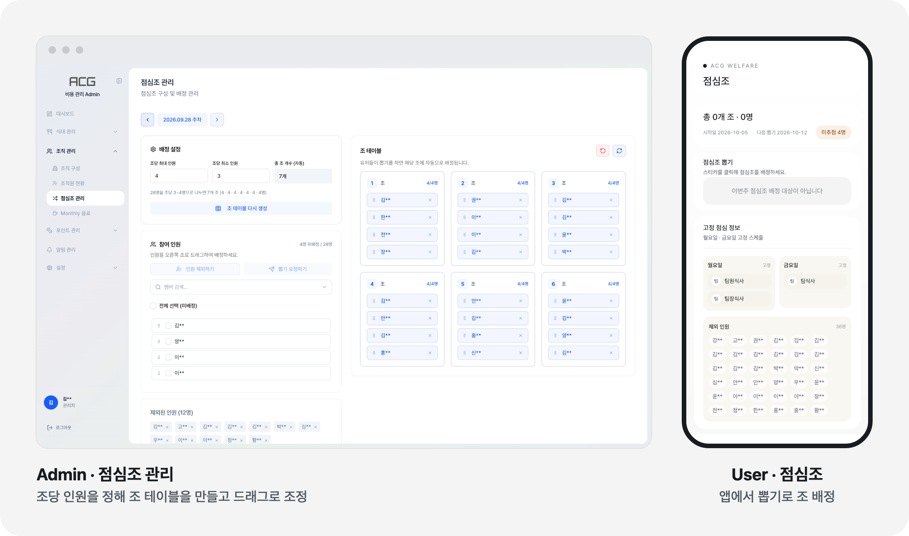

<p align="center">
  
</p>

ACG 임직원 40여 명이 쓰는 사내 복지관리 서비스입니다.
직원은 휴대폰에서 식대와 복지포인트를 기록합니다. 관리자는 대시보드에서 예산을 나누고 정산을 마칩니다.

- **기간** — 2025.08 ~ 운영 중
- **역할** — 설계·개발·배포·운영을 혼자 담당. 요구사항은 P&C팀과 함께 정리
- **사용자** — ACG 임직원 40여 명
- **규모** — 화면 22개, API 라우트 94개, 커밋 687건, PR 72건
- **기술** — Next.js 15, React 19, TypeScript, Supabase, Tailwind CSS 4, Turborepo
- **배포** — Vercel, [meal-acg.vercel.app](https://meal-acg.vercel.app/) (사내 계정으로 로그인)

## 화면

**User 앱** — 직원이 휴대폰에 설치해 쓰는 PWA

<p align="center">
  
</p>

**Admin 앱** — 관리자가 PC에서 쓰는 대시보드

<p align="center">
  
</p>

**점심조 뽑기** — 관리자가 조 테이블을 만들면 직원이 앱에서 뽑습니다

<p align="center">
  
</p>

> 운영 중인 화면을 찍었습니다. 이름, 계좌번호, 사업자등록번호는 별표로 가렸습니다.

## 만든 배경

식대와 복지포인트는 처음에 직원마다 엑셀 파일에 적었습니다. 그 뒤 구글 시트로 옮겼고 다시 웹앱(v1·v2)으로 바꿨습니다.
v3는 직원용 앱과 관리자용 앱 두 개로 이루어진 지금 버전입니다.

- **기록** — 직원이 휴대폰에서 식사와 포인트 사용 내역을 직접 입력합니다. 영수증을 찍으면 금액과 가게 이름이 채워집니다.
- **정산** — 관리자가 예산 할당, 사용내역 검토, 월별 정산을 한 앱에서 처리합니다.
- **이관** — 엑셀에 쌓인 기존 데이터는 가져오기 기능으로 옮기고 정산 자료는 다시 엑셀로 내보냅니다.
- **점심조** — 관리자가 주마다 조 테이블을 만들면 직원은 앱에서 뽑기로 조를 배정받습니다.

## 맡은 일

요구사항은 P&C팀과 정했고 설계부터 운영까지는 혼자 맡았습니다.

- **프론트엔드** — 모바일 PWA(User)와 PC 대시보드(Admin) 화면 22개. 두 앱이 같이 쓰는 UI 컴포넌트는 `@repo/ui` 패키지로 분리
- **백엔드** — Next.js API 라우트 94개. Supabase(PostgreSQL) 테이블, RPC 함수, 마이그레이션 작성
- **외부 연동** — Gemini 영수증 인식, Google Sheets·Calendar, Slack 알림, Web Push
- **배포·운영** — Vercel에 두 앱을 따로 배포. 기능 추가와 오류 수정을 PR 72건으로 반영

## 기술적으로 신경 쓴 부분

**1. 식대 계산 규칙을 코드로 옮기기**
사용가능액은 재택·연차·개별식사 같은 근무 형태와 공휴일, 주말 근무에 따라 달라집니다. 이 규칙을 API 한 곳에서 계산하고 공휴일은 Google Calendar에서 동기화합니다.
→ [`apps/user/app/api/meals/stats/route.ts`](./apps/user/app/api/meals/stats/route.ts)

**2. 데이터를 바꾸면 관련 화면이 모두 갱신되게 하기**
TanStack Query의 Query Key를 팩토리 하나로 모으고 어떤 데이터를 바꾸면 어떤 키를 무효화할지 규칙으로 정했습니다. 구성원 정보는 여러 테이블을 조인한 뷰여서 팀이나 본부가 바뀔 때도 함께 무효화합니다.
→ [`apps/admin/lib/query-keys.ts`](./apps/admin/lib/query-keys.ts), [CLAUDE.md](./CLAUDE.md)

**3. 엑셀 가져오기의 중복 처리**
사람·날짜·구분·내용이 같은 행은 마지막 행만 남깁니다. DB에 이미 있는 기록은 덮어쓰고 바뀐 내용은 감사 로그에 남깁니다.
→ [`apps/admin/app/api/import/points-usage/route.ts`](./apps/admin/app/api/import/points-usage/route.ts)

**4. 점심조 배정**
조당 최대·최소 인원을 지키면서 고르게 나누는 계산을 순수 함수로 떼어 내고 검증 스크립트를 붙였습니다. 배정 결과는 드래그 앤 드롭으로 고칩니다. 직원이 뽑기를 하면 빈자리가 있는 조 가운데 하나에 무작위로 들어갑니다. 관리자가 제외한 인원은 뽑을 수 없습니다.
→ [`apps/admin/lib/lunch-group-plan.ts`](./apps/admin/lib/lunch-group-plan.ts), [`apps/user/app/api/lunch-group/assign/route.ts`](./apps/user/app/api/lunch-group/assign/route.ts)

**5. 성능 최적화 12건**
애니메이션 라이브러리를 필요할 때만 불러와 초기 번들을 약 60KB 줄였습니다. 순서대로 부르던 DB 쿼리는 병렬로 바꿨습니다. 적용한 내용은 전후 비교와 함께 문서로 남겼습니다.
→ [PERF-OPTIMIZATION.md](./PERF-OPTIMIZATION.md)

## 개발 방식

요구사항을 먼저 문서로 정리하고([POINTS.md](./POINTS.md), [LOTTERY.md](./LOTTERY.md)) Claude Code를 활용해 구현했습니다.
코드 규칙과 주의할 점은 [CLAUDE.md](./CLAUDE.md)에 모아 두었습니다. 빌드가 타입·린트 오류를 잡지 않아서 `pnpm check-types`와 `pnpm lint`를 따로 돌립니다.

## 주요 기능

### User 앱

| 기능 | 설명 |
|------|------|
| 식사 기록 | 조식·중식·석식 금액과 가게를 캘린더에서 입력하고 조회 |
| 영수증 스캔 | Gemini AI가 영수증을 읽어 금액과 가게를 채움 |
| 복지포인트 | 잔액 조회, 사용 내역 등록·수정, 전체 내역 무한 스크롤 |
| 활동비 | 팀장·본부장 전용. 팀별 현황과 사용 내역 관리 |
| 점심조 뽑기 | 스티커를 눌러 이번 주 점심조를 뽑고 조 편성, 고정 점심, 제외 인원을 확인 |
| 음료 취합 | Monthly 음료 주문 취합 |
| 푸시 알림 | Web Push로 공지와 알림 수신 |
| PWA | 홈 화면에 설치해 앱처럼 실행 |

### Admin 앱

| 기능 | 설명 |
|------|------|
| 대시보드 | 인원 현황, 정산 현황, 식대·복지포인트·활동비 사용률 |
| 식대 관리 | 사용현황, 식대 입력, 기본금 설정, Excel 가져오기·내보내기 |
| 조직 관리 | 조직 구성, 조직원 현황, Monthly 음료 |
| 점심조 관리 | 조당 최대·최소 인원으로 조 테이블 생성, 드래그 앤 드롭 배정, 인원 제외, 요일별 고정 스케줄, 뽑기 요청 알림 |
| 포인트 관리 | 복지포인트·활동비 예산 할당, 사용내역 검토, 사용 내역 조회 |
| 정산 | 월별 정산 완료 처리, 미정산자에게 Slack으로 정산 요청 |
| 알림 관리 | 전체·개인 공지 Web Push 발송 |
| 공휴일 관리 | Google Calendar의 한국 공휴일 동기화 |

## 식대 계산 방식

근무한 날만 식대에 포함합니다.

```
사용가능액 = 일일단가 × (근무일 - 휴일 - 재택 - 개별 + 주말근무)
```

`meal_logs.attendance` 컬럼 값에 따라 포함 여부가 갈립니다.

| 값 | 식대 포함 |
|----|----------|
| `근무` | O |
| `근무(개별식사 / 식사안함)` | X |
| `재택근무` | X |
| `연차/휴무` | X |
| `오전 반차/휴무` | X |
| `오후 반차/휴무` | X |

## 빠른 시작

Node.js 18 이상과 pnpm 8이 필요합니다.

```bash
pnpm install

# apps/user/.env.local, apps/admin/.env.local 작성 (아래 "환경 변수" 참고)

pnpm dev          # 두 앱 모두 실행 (user :3000, admin :3002)
pnpm dev:user     # User 앱만
pnpm dev:admin    # Admin 앱만
```

3000번 포트가 이미 쓰이고 있으면 User 앱은 다음 빈 포트에서 뜹니다.

```bash
pnpm build        # 전체 빌드 (build:user, build:admin으로 앱별 빌드)
pnpm lint         # ESLint, 경고 0개 정책
pnpm check-types  # TypeScript 타입 체크
pnpm format       # Prettier
```

> 두 앱 모두 `next.config`에서 빌드 중 TypeScript·ESLint 오류를 무시합니다. `pnpm check-types`와 `pnpm lint`는 직접 실행해야 합니다.

## 기술 스택

| 영역 | 기술 |
|------|------|
| 프레임워크 | Next.js 15 (App Router, Turbopack), React 19 |
| 언어 | TypeScript 5 (strict) |
| 스타일 | Tailwind CSS 4, Motion 12, Radix UI |
| 상태 | Zustand 5 (클라이언트), TanStack Query 5 (서버) |
| 백엔드 | Supabase (PostgreSQL, RLS, RPC) |
| AI | Google Gemini (영수증 스캔) |
| 외부 연동 | Google Sheets, Google Calendar, Slack |
| 알림 · PWA | Web Push (VAPID), @ducanh2912/next-pwa |
| 빌드 | Turborepo, pnpm workspaces |

<details>
<summary><b>프로젝트 구조</b></summary>

```
apps/
├── user/                 # 직원용 Next.js 앱
│   ├── app/
│   │   ├── (content)/    # dashboard, points, lunch, monthly
│   │   └── api/          # API Routes
│   ├── components/
│   ├── hooks/            # use-meal-data, use-points-data 등
│   ├── lib/              # Supabase 클라이언트, query-keys
│   └── stores/           # Zustand (userStore, mealDrawerStore)
└── admin/                # 관리자용 Next.js 앱
    ├── app/
    │   ├── (auth)/       # 로그인
    │   ├── (dashboard)/  # 대시보드 화면
    │   └── api/          # stats, members, budget, settlement 등
    ├── hooks/
    └── lib/              # Supabase 클라이언트, 인증, Excel 파서

packages/
├── ui/                   # @repo/ui — Radix 기반 공유 컴포넌트
├── utils/                # @repo/utils — dayjs, KST 날짜 함수
├── eslint-config/
├── typescript-config/
└── tailwind-config/
```

</details>

<details>
<summary><b>환경 변수</b></summary>

`apps/user/.env.local`

```bash
NEXT_PUBLIC_SUPABASE_URL=         # Supabase 프로젝트 URL
SUPABASE_SERVICE_ROLE_KEY=        # Supabase 서비스 역할 키

GOOGLE_CLIENT_EMAIL=              # Google 서비스 계정 이메일
GOOGLE_PRIVATE_KEY=               # Google 서비스 계정 키
GOOGLE_SHEET_ID=                  # Monthly 음료 시트 ID

GEMINI_API_KEY=                   # Gemini API 키 (영수증 스캔)

NEXT_PUBLIC_VAPID_PUBLIC_KEY=     # Web Push 공개 키 (브라우저 구독용)
VAPID_PUBLIC_KEY=                 # Web Push 공개 키 (서버 발송용)
VAPID_PRIVATE_KEY=                # Web Push 비공개 키
VAPID_SUBJECT=                    # Web Push 발신자 (mailto: 주소)
```

`apps/admin/.env.local`

```bash
NEXT_PUBLIC_SUPABASE_URL=         # Supabase 프로젝트 URL
NEXT_PUBLIC_SUPABASE_ANON_KEY=    # Supabase 공개 키
SUPABASE_SERVICE_ROLE_KEY=        # Supabase 서비스 역할 키

GOOGLE_CALENDAR_API_KEY=          # Google Calendar API 키 (공휴일 동기화)
SLACK_BOT_TOKEN=                  # Slack 봇 토큰 (정산 요청 발송)

VAPID_PUBLIC_KEY=                 # Web Push 공개 키
VAPID_PRIVATE_KEY=                # Web Push 비공개 키
VAPID_SUBJECT=                    # Web Push 발신자 (mailto: 주소)
```

</details>

<details>
<summary><b>데이터베이스</b></summary>

마이그레이션은 `supabase/migrations/`에 `YYYYMMDD_description.sql` 형식으로 둡니다.

```bash
supabase start                    # 로컬 Supabase 실행
supabase db reset                 # DB 초기화 후 마이그레이션 전체 적용
supabase migration new <name>     # 새 마이그레이션 파일 생성
```

스키마를 바꾸면 타입도 다시 생성합니다.

```bash
supabase gen types typescript --project-id <id> > apps/admin/lib/supabase/types.ts
```

집계처럼 무거운 쿼리는 RPC 함수로 DB에서 처리합니다. 예: `get_user_monthly_stats`(월별 식사 통계), `calculate_activity_budget`(활동비 예산 계산).

</details>

<details>
<summary><b>코드 패턴과 규칙</b></summary>

**데이터 흐름**

```
사용자 입력 → React Query Mutation → API Route → Supabase → 캐시 무효화 → UI 갱신
```

**Query Key 팩토리** — 각 앱의 `lib/query-keys.ts`에 모아 둡니다.

```typescript
queryKeys.meals.byUserAndMonth(userName, month, year)
queryKeys.points.welfare.byPeriod(memberId, period)
queryKeys.points.activity.byPeriod(memberId, period)
```

**커스텀 훅** — `use-{resource}.ts` 또는 `use-{resource}-{action}.ts`로 이름 짓습니다.

```typescript
useMealData(userName, month, year)   // 조회
useMealSubmit()                      // mutation
```

**인증**

- User 앱: 아이디·비밀번호로 로그인하고 Zustand + localStorage로 세션 유지
- Admin 앱: 쿠키 세션 + 미들웨어 보호 + API의 `requireAdmin()` 가드

**규칙**

- ESLint 경고 0개 (`--max-warnings 0`), TypeScript strict
- 날짜는 모두 KST 기준. `@repo/utils`의 dayjs 함수를 씁니다.
- 커밋 메시지는 한글로 쓰고 `feat` / `fix` / `refactor` / `style` / `docs` 접두어를 붙입니다.

</details>

## 문서

- [POINTS.md](./POINTS.md) — 복지포인트·활동비 관리 설계
- [LOTTERY.md](./LOTTERY.md) — 점심조 자동 배정 요구사항
- [EXCEL_IMPORT.md](./EXCEL_IMPORT.md) · [EXCEL_IMPORT_CALC.md](./EXCEL_IMPORT_CALC.md) — 식대 Excel 가져오기·내보내기 규칙
- [PERF-OPTIMIZATION.md](./PERF-OPTIMIZATION.md) — 성능 최적화 기록
- [CLAUDE.md](./CLAUDE.md) — 코드 패턴과 주의사항 상세
