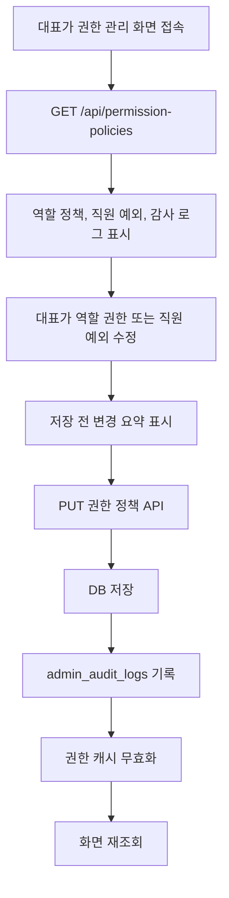
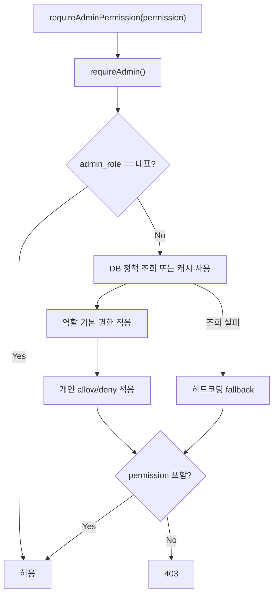

# Admin Permission Policy Management Design

## Goal

대표가 어드민 앱에서 운영 권한 정책을 직접 관리할 수 있는 화면과 API를 추가한다. 권한은 역할 기본값과 직원별 예외를 조합해 계산하며, 대표 계정은 항상 전체 권한을 유지해 잠김 사고를 방지한다.

## Current Context

현재 어드민 권한은 `apps/admin/lib/rbac.ts`의 `ADMIN_ROLE_PERMISSIONS`에 하드코딩되어 있다. 최근 개인정보 보호 강화 작업으로 `members:sensitive:read`, `export:bulk`, `audit:read`, `rbac:manage` 같은 고위험 권한이 추가됐지만, 운영자가 화면에서 권한 정책을 조정할 수는 없다.

기존 관리자 정보는 `members.role`, `members.admin_role`, `members.user_authority`를 사용한다. `admin_role`은 `대표`, `팀장`, `일반`이며, 대표는 모든 권한을 가져야 한다.

## Scope

포함한다:

- 역할별 권한 정책 저장 테이블
- 직원별 권한 예외 저장 테이블
- 대표 전용 권한 관리 화면
- 대표 전용 권한 정책 API
- `requireAdminPermission()`의 DB 정책 기반 권한 판단
- 권한 변경 감사 로그
- 정책 미설정 또는 조회 실패 시 기존 하드코딩 권한 fallback

포함하지 않는다:

- 일반 사용자 앱 권한 체계 변경
- 조직 직군 `member_role` 기반 권한 정책
- 운영 Supabase 배포 자동화
- 외부 IdP 또는 SSO 연동

## Permission Model

권한 정책은 역할 기본 권한과 개인 예외 권한으로 나눈다.

### Role Policies

새 테이블 `admin_role_permission_policies`를 둔다.

- `admin_role`: `대표 | 팀장 | 일반`
- `permission`: `AdminPermission` 권한 키
- `enabled`: 해당 역할의 기본 허용 여부
- `created_at`, `updated_at`

대표 역할은 화면에서 읽기 전용으로 표시하고, 권한 판단에서는 항상 전체 권한으로 처리한다. 대표의 DB 행은 초기 상태 표시용으로만 사용한다.

### Member Overrides

새 테이블 `admin_member_permission_overrides`를 둔다.

- `member_id`: `members.id`
- `permission`: `AdminPermission` 권한 키
- `effect`: `allow | deny`
- `created_at`, `updated_at`

대표 계정에는 개인 예외를 적용하지 않는다. API도 대표 직원에 대한 override 저장 요청을 거부한다.

### Effective Permissions

최종 권한 계산 순서:

1. 대상 관리자의 `admin_role`이 `대표`면 전체 권한 반환
2. `admin_role`의 기본 권한을 DB 정책에서 로드
3. 개인 예외 `allow`를 추가
4. 개인 예외 `deny`를 제거
5. 정책 테이블이 없거나 조회에 실패하면 기존 `ADMIN_ROLE_PERMISSIONS`를 fallback으로 사용

## UI Design

사이드바 설정 영역에 `권한 관리` 메뉴를 추가한다. 메뉴 접근은 대표만 가능하게 한다.

화면은 3개 영역으로 구성한다.

### Role Permissions

- 탭: `대표`, `팀장`, `일반`
- `대표` 탭은 모든 권한이 체크된 읽기 전용 상태
- `팀장`, `일반` 탭은 권한 그룹별 체크박스 제공
- 저장은 자동 저장이 아니라 `저장` 버튼으로 수행

권한 그룹:

- 직원/조직
- 민감정보/다운로드
- 복지포인트/식대
- 근태/휴가
- 재무/평가
- 설정/감사 로그

고위험 권한은 별도 강조한다.

- `members:sensitive:read`
- `export:bulk`
- `rbac:manage`
- `audit:read`

### Member Overrides

- 직원 검색
- 선택 직원의 현재 `admin_role` 표시
- 권한별 현재 상태 표시
  - 역할 기본 허용
  - 개인 추가 허용
  - 개인 차단
  - 권한 없음
- 대표 직원은 읽기 전용이며 예외 설정 불가로 표시

### Change History

하단에 최근 권한 변경 감사 로그를 표시한다.

표시 항목:

- 변경 시각
- 작업자
- 대상 역할 또는 직원
- 변경 권한
- 변경 유형

## API Design

모든 API는 대표 전용으로 제한한다. 서버 측에서는 `requireAdminPermission("rbac:manage")`와 대표 역할 확인을 함께 사용한다.

### `GET /api/permission-policies`

반환:

- 권한 metadata
- 역할별 정책
- 직원별 예외 권한
- 최근 권한 변경 감사 로그

### `PUT /api/permission-policies/roles`

입력:

- `adminRole`: `팀장 | 일반`
- `permissions`: enabled 권한 키 배열

동작:

- 대표 역할 변경 요청은 400 처리
- 해당 역할의 권한 정책을 upsert
- 모든 권한 키에 대해 row를 유지하고, 해제된 권한은 `enabled=false`로 저장
- 감사 로그 action: `permission.role_policy_update`
- 권한 정책 캐시 무효화

### `PUT /api/permission-policies/members/[id]`

입력:

- `overrides`: `{ permission, effect }[]`

동작:

- 대상 직원이 대표면 400 처리
- 기존 override를 요청값으로 교체
- 감사 로그 action: `permission.member_override_update`
- 권한 정책 캐시 무효화

## Data Flow

권한 검사 흐름:

## Error Handling

- 정책 조회 실패: 서버 로그를 남기고 하드코딩 fallback 사용
- 정책 저장 실패: 500 응답, 화면은 실패 메시지와 재시도 버튼 표시
- 대표 역할 수정 요청: 400 응답
- 대표 직원 override 요청: 400 응답
- 권한 없는 접근: 403 응답

저장 실패 시 화면 상태를 강제로 원복하지 않는다. 사용자가 변경 내용을 확인한 뒤 재시도하거나 새로고침할 수 있게 한다.

## Security Notes

- 대표는 항상 전체 권한으로 계산한다.
- `rbac:manage`를 가진 팀장이라도 권한 관리 화면/API에는 접근할 수 없다. 대표 역할 확인이 필요하다.
- 권한 변경 요청에는 raw 민감정보를 포함하지 않는다.
- 감사 로그 metadata에는 권한 키, 대상 역할/직원 ID, 변경 전후 요약만 저장한다.
- 권한 정책 API는 service role Supabase client를 쓰되, 반드시 서버 세션의 대표 여부를 먼저 검증한다.

## Testing

필수 검증:

- 대표는 전체 권한을 가진다.
- 대표 역할 권한은 API에서 수정할 수 없다.
- 대표 직원 override는 API에서 거부된다.
- 팀장/일반 역할 정책 저장 후 `requireAdminPermission()`에 반영된다.
- 직원별 `allow` override가 역할 기본 권한에 없는 권한을 추가한다.
- 직원별 `deny` override가 역할 기본 권한에 있는 권한을 제거한다.
- 정책 테이블이 비어 있어도 기존 fallback 권한으로 동작한다.
- 권한 변경 시 `admin_audit_logs`에 기록된다.
- `pnpm --filter admin check-types` 통과
- `pnpm --filter admin build` 통과

## Implementation Boundaries

권한 계산 로직은 `apps/admin/lib/rbac.ts` 또는 인접한 서버 전용 helper로 분리한다. UI는 권한 metadata와 현재 정책을 API에서 받아 렌더링하며, 권한 키 배열을 화면에 직접 하드코딩하지 않는다. 기존 직원 관리 화면의 `admin_role` 변경 기능은 유지하되, 실제 권한 판단은 새 정책을 우선한다.
