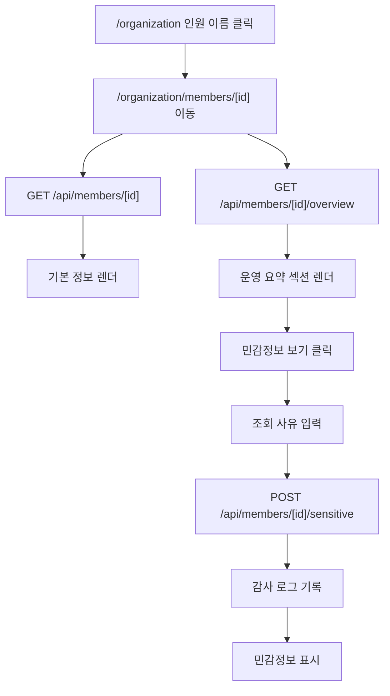

# Organization Member Detail Design

## Goal

Admin 앱의 `/organization` 페이지에서 인원을 클릭하면 해당 인원의 독립 상세 페이지로 이동한다. 상세 페이지는 기본 인사 정보와 현재 기준 운영 요약을 보여주고, 민감정보는 RBAC 권한과 감사 로그 흐름을 거쳐 별도로 조회한다.

## Current Context

현재 `/organization`은 `apps/admin/app/(dashboard)/organization/page.tsx`가 중심이며, 기본 진입 화면은 `MemberStatusView`를 통해 조직원 현황 표를 보여준다. 이전 작업으로 `/member-status`는 `/organization`에 통합되었고, 조직 구성 편집은 명시적 편집 화면으로 분리되어 있다.

인원 목록에서 이름 클릭은 현재 인원 수정 다이얼로그를 연다. 새 요구사항에서는 이 클릭 동작을 상세 페이지 이동으로 바꾸고, 수정 기능은 별도 버튼이나 아이콘으로 유지한다.

멤버 기본 상세 API는 이미 존재한다.

- `GET /api/members/[id]`: `members:read` 권한 필요, 민감 필드 제외
- `POST /api/members/[id]/sensitive`: `members:sensitive:read` 권한 필요, 사유 필수, 감사 로그 기록

최근 개인정보 보호 강화 작업으로 `birth_date`, `phone`, `passport_number`는 일반 상세 응답에서 제외되고, 민감정보 조회는 권한과 감사 로그로 분리되어 있다. 이 경계를 유지한다.

## Scope

포함한다:

- `/organization/members/[id]` 상세 페이지
- `/organization` 인원 이름 클릭 시 상세 페이지 이동
- 수정 진입 액션 분리
- 현재 기준 운영 요약 API
- 기본 정보, 현재 특이사항, 올해 휴가/근태 요약, 현재 반기 식대/복지포인트 요약 표시
- 기존 민감정보 API를 사용하는 사유 입력 후 조회 UI
- 섹션별 권한 없음, 데이터 없음, 조회 실패 상태

포함하지 않는다:

- 민감정보 수정 기능
- 운영 이력 전체 목록 또는 기간 필터
- 조직도 편집 흐름 재설계
- 기존 `/dayoffs`, `/attendance`, `/points-overview` 업무 화면 대체
- RBAC 권한 체계 변경 자체

## Route And Navigation

새 라우트:

- `/organization/members/[id]`

`/organization`의 조직원 현황 표에서 인원 이름을 클릭하면 새 상세 라우트로 이동한다. 기존 수정 다이얼로그는 이름 클릭에서 제거하고, 행 우측 또는 상세 페이지 상단의 `수정` 액션으로 접근한다.

상세 페이지 상단 구성:

- `조직원 현황으로 돌아가기` 링크
- 인원 이름
- 직급, 직책, 팀
- 현재 상태 배지
- `수정` 버튼

직접 URL 진입도 지원한다. 대상 멤버가 없으면 404 또는 `인원을 찾을 수 없습니다` 상태를 보여준다.

## API Design

### Existing Member Detail

`GET /api/members/[id]`를 기본 인사 정보 조회에 재사용한다.

일반 상세에 포함한다:

- 이름
- 로그인 아이디
- 이메일
- 조직, 본부, 팀
- 직급, 직책
- 관리자 역할과 사용자 권한
- 입사일

일반 상세에 포함하지 않는다:

- 비밀번호
- 생년월일
- 휴대폰번호
- 여권번호

### New Member Overview

새 API:

- `GET /api/members/[id]/overview`

이 API는 현재 기준 요약만 반환한다. 서버에서 집계하고, 클라이언트는 표시 책임만 가진다.

```ts
type MemberOverviewResponse = {
  currentStatus: {
    status: string | null;
    startDate: string | null;
    endDate: string | null;
    note: string | null;
  };
  leave: {
    year: number;
    usedDays: number;
    approvedCount: number;
    pendingCount: number;
  } | null;
  attendance: {
    year: number;
    month: number;
    checkedInDays: number;
    lateCount: number;
    absentCount: number;
  } | null;
  points: {
    period: string;
    mealUsed: number;
    welfareUsed: number;
    mealBudget: number;
    welfareBudget: number;
  } | null;
  permissions: {
    leave: boolean;
    attendance: boolean;
    points: boolean;
    meal: boolean;
  };
};
```

권한 기준:

- API 진입 기본 권한: `members:read`
- 특이사항: `members:read`
- 휴가 요약: `leave:read`
- 근태 요약: `attendance:read`
- 복지포인트 요약: `points:read`
- 식대 요약: `meal:read`

권한이 없는 섹션은 `null`과 `permissions` 플래그로 표현한다. 전체 API를 실패시키지 않고, 상세 페이지에서 해당 섹션만 `권한 없음` 상태로 표시한다.

집계 기준:

- 휴가: 현재 연도 기준
- 근태: 현재 연도와 현재 월 기준
- 식대/복지포인트: 현재 반기 기준. 1월부터 6월은 `YYYY-H1`, 7월부터 12월은 `YYYY-H2`

## Sensitive Information

민감정보는 페이지 최초 로딩과 일반 overview API에 포함하지 않는다. 기존 API를 그대로 사용한다.

- `POST /api/members/[id]/sensitive`
- 요청 body: `{ reason: string }`
- 필요 권한: `members:sensitive:read`
- 감사 로그 action: `member.sensitive_view`

UI 흐름:

1. 민감정보 섹션에는 기본적으로 `민감정보 보기` 버튼을 표시한다.
2. 버튼 클릭 시 조회 사유 입력 모달을 연다.
3. 사유가 없으면 요청하지 않는다.
4. 성공하면 생년월일, 휴대폰번호, 여권번호를 현재 화면 상태에만 표시한다.
5. 실패하면 모달 내부에 오류를 표시한다.

권한이 없는 관리자는 버튼 대신 `대표 권한 또는 민감정보 조회 권한이 필요합니다` 안내를 본다. UI의 표시 여부는 역할명을 직접 하드코딩하지 않고 `members:sensitive:read` 권한 결과에 의존한다. 대표는 현재 RBAC 정책상 전체 권한을 가지므로 접근 가능하다.

## UI Design

상세 페이지는 운영 화면에 맞게 조용하고 밀도 있게 구성한다. 장식적인 히어로 영역은 만들지 않는다.

레이아웃:

- 상단: 뒤로가기, 이름/소속/상태, 수정 액션
- 본문: 데스크톱 2열, 좁은 화면 1열
- 카드 사용은 개별 정보 섹션 단위로 제한한다

섹션:

1. 기본 정보
   - 로그인 아이디, 이메일, 조직/본부/팀, 직급/직책, 권한, 입사일
2. 현재 특이사항
   - 정상 또는 현재 특이사항, 시작일, 종료일, 메모
3. 올해 휴가 요약
   - 사용 일수, 승인 건수, 대기 건수
4. 이번 달 근태 요약
   - 출근 일수, 지각 건수, 결근 건수
5. 현재 반기 식대/복지포인트 요약
   - 예산, 사용액, 잔액
6. 민감정보
   - 권한 있는 사용자만 사유 입력 후 조회

각 운영 섹션에는 필요하면 기존 업무 화면으로 이동하는 링크를 둘 수 있다. 이 링크는 상세 페이지가 전체 업무 화면을 대체하지 않도록 보조 동선으로만 둔다.

## Error Handling

- 멤버 없음: 404 또는 `인원을 찾을 수 없습니다`
- 기본 정보 조회 실패: 페이지 전체 오류
- overview 조회 실패: 운영 요약 영역에 재시도 가능한 오류 상태
- 섹션별 권한 없음: 해당 섹션만 비활성 안내
- 데이터 없음: 권한 없음과 구분해 `등록된 데이터가 없습니다` 표시
- 민감정보 사유 없음: 클라이언트에서 요청 전 차단
- 민감정보 권한 없음: API의 401/403 메시지를 모달 내부에 표시

## Data Flow



## Testing

필수 검증:

- `/organization`에서 인원 이름 클릭 시 `/organization/members/[id]`로 이동한다.
- 상세 URL 직접 진입 시 기본 정보와 운영 요약이 표시된다.
- 이름 클릭은 더 이상 수정 다이얼로그를 열지 않는다.
- 수정 액션은 별도 버튼으로 접근 가능하다.
- 민감정보는 초기 기본 정보 API와 overview API 응답에 포함되지 않는다.
- `members:sensitive:read` 권한이 없으면 민감정보 조회가 실패한다.
- 민감정보 조회 성공 시 감사 로그가 남는다.
- 운영 요약 섹션은 권한 없음, 데이터 없음, 조회 실패를 구분한다.
- 타입체크를 통과한다.
- `git diff --check`를 통과한다.

권장 스모크:

- 대표 계정으로 민감정보 조회 사유 입력 후 표시 확인
- 일반 관리자 계정에서 민감정보 버튼 비활성 또는 권한 없음 안내 확인
- 올해/이번 달/현재 반기 기준값이 날짜에 맞게 계산되는지 확인
